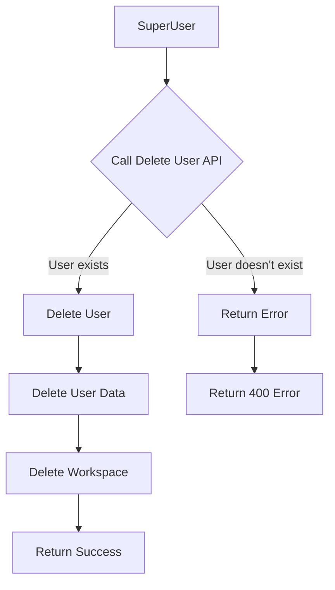

# Delete User

Delete an existing user and their associated workspace from your super-user account. This endpoint allows superusers to remove user accounts when needed.

## API Endpoint

```http
POST super/delete-user
```

## Authentication

This endpoint requires SuperUser API key authentication. Include your API key in the request headers:

```http
sivi-api-key: YOUR_SUPER_API_KEY
```

:::caution SuperUser Access Required
This endpoint can only be accessed using an SuperUser API key. Regular API keys do not have sufficient privileges.
:::

## Request Body

```json
{
  "abstractUserId": "281743-2322-34i44sd3-dkfjgdkjf292"
}
```

## Request Parameters

| Parameter | Type | Required | Description |
|-----------|------|----------|-------------|
| abstractUserId | string | Yes | Unique identifier for the user to delete |

## Response

### Successful Deletion

```json
{
  "status": 200,
  "body": {
    "message": "Successfully deleted the user"
  }
}
```

### User Not Found

```json
{
  "status": 400,
  "body": {
    "message": "User does not exists"
  }
}
```

### Authentication Error

```json
{
  "status": 401,
  "body": {
    "message": "Failed to authenticate request. Please add sivi-api-key header in request"
  }
}
```

### Invalid Input

```json
{
  "status": 422,
  "body": {
    "message": "Invalid input"
  }
}
```

## Usage Notes

- This operation permanently deletes a user and their workspace
- All designs, content, and settings associated with the user will be irreversibly removed
- This action cannot be undone
- If the user doesn't exist in Sivi's system, the operation will fail with a 400 status code

:::warning
User deletion is permanent. Data is maintained for 15 days and post that data is purged
:::

## Example

```bash
curl -X POST "https://connect.sivi.ai/api/prod/v2/super/delete-user" \
  -H "sivi-api-key: YOUR_SUPER_API_KEY" \
  -H "Content-Type: application/json" \
  -d '{
  "abstractUserId": "user-12345"
}'
```

## User Deletion Flow

The following flowchart illustrates the user deletion process:



## Related APIs

- [Login User](./login-user) - Create a new user or login an existing user
