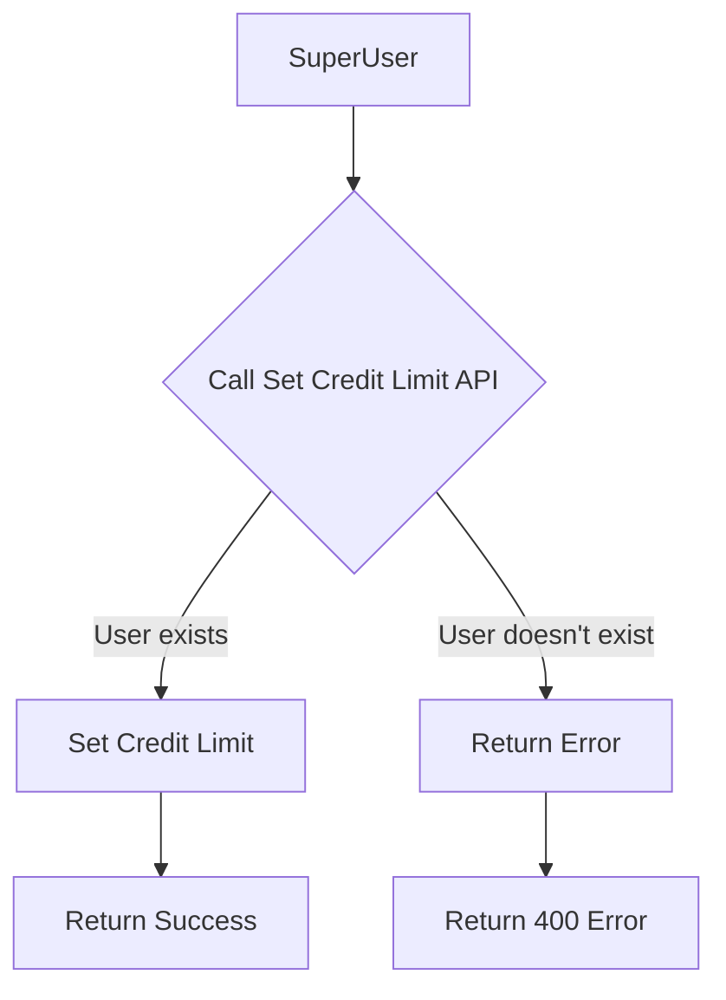

# Set Credit Limit

Set the credit limit for a user for the current billing cycle. This endpoint allows superusers to set the credit limit for their end-user. By default, the credit limit is set to -1, which means no limit. You can set it to any positive value to set a limit.

> **Note:** End-user's usage credits will be debited from the master user's credits. This API helps to control the credit usage for end-users.

## API Endpoint

```http
POST super/set-user-credit-limit
```

## Authentication

This endpoint requires SuperUser API key authentication. Include your API key in the request headers:

```http
sivi-api-key: YOUR_SUPER_API_KEY
```

:::caution SuperUser Access Required
This endpoint can only be accessed using an SuperUser API key. Regular API keys do not have sufficient privileges.
:::

## Request Body

```json
{
  "abstractUserId": "281743-2322-34i44sd3-dkfjgdkjf292",
  "creditLimit": -1
}
```

## Request Parameters

| Parameter | Type | Required | Description |
|-----------|------|----------|-------------|
| abstractUserId | string | Yes | Unique identifier for the user to delete |
| creditLimit | number | Yes | Credit limit for the user |

## Response

### Successful Deletion

```json
{
  "status": 200,
  "body": {
    "message": "Credit limit set successfully."
  }
}
```

### User Not Found

```json
{
  "status": 400,
  "body": {
    "message": "User does not exists"
  }
}
```

### Authentication Error

```json
{
  "status": 401,
  "body": {
    "message": "Failed to authenticate request. Please add sivi-api-key header in request"
  }
}
```

### Invalid Input

```json
{
  "status": 422,
  "body": {
    "message": "Invalid input"
  }
}
```

### Insufficient Credit

```json
{
  "status": 429,
  "body": {
    "message": "Insufficient credit limit"
  }
}
```

## Usage Notes

- This operation sets the credit limit for a user for the current billing cycle. After limit is reached, the user will not be able to generate designs or content until the next billing cycle. API's will start throwing error with 429 status code.
- By default, the credit limit is set to -1, which means no limit.
- If the user doesn't exist in Sivi's system, the operation will fail with a 400 status code
- "creditLimit" should be a positive integer, -ve values are not allowed.

## Example

```bash
curl -X POST "https://connect.sivi.ai/api/prod/v2/super/set-user-credit-limit" \
  -H "sivi-api-key: YOUR_SUPER_API_KEY" \
  -H "Content-Type: application/json" \
  -d '{
  "abstractUserId": "user-12345",
  "creditLimit": 100
}'
```

## User Deletion Flow

The following flowchart illustrates the user set credit limit process:



## Related APIs

- [Login User](./login-user) - Create a new user or login an existing user
