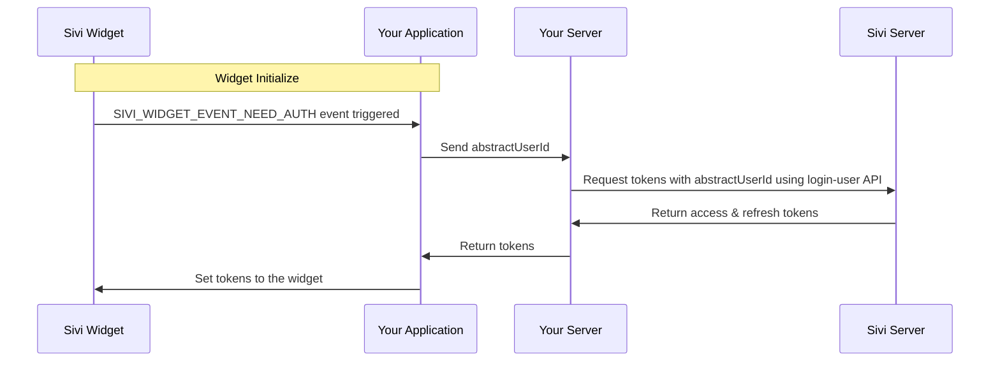

# Authentication

This document explains how authentication works with the Sivi UI SDK and provides examples for superuser implementations.

## Authentication Methods Overview

Sivi UI SDK supports two authentication approaches:

1. **Standard UI SDK Authentication** - Default authentication flow with login UI. User will be redirected to Sivi's login page. Refer [Standard UI SDK Authentication](../authentication) for more details.
2. **Superuser Based Authentication** - Frictionless machine-to-machine authentication without end-user intervention.


## Superuser Based Authentication

Superuser based implementations benefit from a frictionless authentication system with these advantages:

- **User Abstraction** - Sivi does not store any of your users' personal information
- **Seamless Integration** - Users don't need to create separate Sivi accounts
- **Programmatic Auth** - Authentication happens via API without user intervention

The authentication process works as follows:

1. Your frontend application captures the `SIVI_WIDGET_EVENT_NEED_AUTH` event from the Sivi widget
2. Your backend server makes a call to the Sivi Login User API to obtain tokens for your user
3. Your application provides the tokens to the widget during initialization
4. The widget uses these tokens for all subsequent API calls to Sivi Server

### Authentication Sequence Flow



### Authentication API

To authenticate users programmatically, use the Login User API endpoint:

See the [Login User API Reference](../../sivi-api/user-management-api/login-user) for complete details.

### Widget Authentication Example

Implementing superuser based authentication with the widget using the `SIVI_WIDGET_EVENT_INIT` event:

```javascript
// First register the event handler to provide auth tokens
window.SIVI.events(async (event, responseCallback) => {
  switch (event.type) {
    case 'SIVI_WIDGET_EVENT_NEED_AUTH': {
      try {
        // Get tokens from your backend server
        const authResponse = await fetch('/your-backend-auth-endpoint', {
          method: 'POST',
          headers: {
            'Content-Type': 'application/json',
          },
          body: JSON.stringify({
            userId: 'your-current-user-id' // this will be passed as an abstract user id for us.
          })
        });
        
        const authData = await authResponse.json();
        
        // Return tokens to the widget
        responseCallback({
          accessToken: authData.accessToken,
          refreshToken: authData.refreshToken
        });
      } catch (error) {
        console.error('Authentication failed', error);
        responseCallback({
          error: 'Authentication failed'
        });
      }
      break;
    }
    
    // Handle other events...
    default:
      responseCallback('done');
      break;
  }
});

// Then open the widget
window.SIVI.show({
  type: "socialMedia",
  subtype: "instagram",
  // Other configuration options...
}, "sivi-container");
```

### Token Refresh Handling
Widget handles the token refresh automatically after setting the tokens.
<!-- 
## React Implementation Example

Here's a complete example of implementing superuser based authentication in a React component:

```jsx
import React, { useEffect, useRef } from 'react';

function YourSideBar() {
  const containerRef = useRef(null);
  
  useEffect(() => {
    // Initialize event handling for authentication
    window.SIVI.events(async (event, responseCallback) => {
      switch (event.type) {
        case 'SIVI_WIDGET_EVENT_NEED_AUTH': {
          try {
            // Get auth tokens from your backend
            const response = await fetch('/api/sivi-auth', {
              method: 'POST',
              headers: {
                'Content-Type': 'application/json',
              },
              credentials: 'include', // To include cookies if needed
            });
            
            const authData = await response.json();
            
            if (authData.success) {
              // Return tokens to the widget
              responseCallback({
                accessToken: authData.data.accessToken,
                refreshToken: authData.data.refreshToken
              });
            } else {
              throw new Error('Failed to authenticate');
            }
          } catch (error) {
            console.error('Authentication error:', error);
            responseCallback({ error: 'Authentication failed' });
          }
          break;
        }
        
        // Handle other events as needed
        default:
          responseCallback('done');
          break;
      }
    });
    
    // Initialize the widget
    window.SIVI.show({
      type: "socialMedia",
      subtype: "instagram",
      dimension: {
        width: 1080,
        height: 1080
      },
      config: {
        enableDesignEditor: true
      }
    }, "sivi-container");
    
    // Cleanup when component unmounts
    return () => {
      window.SIVI.hide();
      window.SIVI.removeEventsCallback();
    };
  }, []);
  
  return (
    <div className="sivi-widget-wrapper">
      <div id="sivi-container" ref={containerRef} style={{ width: '100%', height: '600px' }} />
    </div>
  );
}

export default YourSideBar;
``` -->

## Security Best Practices

1. **Never expose your API Key** in client-side code
2. **Always authenticate users** on your backend server
3. **Use HTTPS** for all API calls
4. **Validate user identity** before requesting tokens

